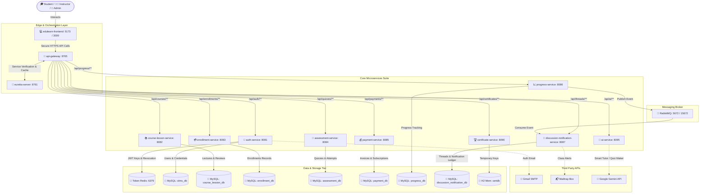

# 🎓 EduLearn — Distributed Microservices Online Learning Management System (LMS)

Welcome to the **EduLearn** repository. This is an enterprise-grade, distributed **Online Learning Management System (LMS)** designed with a state-of-the-art React frontend and a robust Spring Boot microservices-driven backend architecture.

---

## 🗺️ System Architecture Blueprint

Below is the conceptual layout of the EduLearn monorepo, showcasing how the frontend, discovery servers, API Gateway, core business engines, message brokers, and database layers interlock:



---

## 🔌 System Ports & Component Reference

Below is the definitive port register for all active modules, dependencies, and infrastructure layers running within the EduLearn system:

| Module / Component | Language / Technology | Local Port | Database Schema | Primary Purpose |
| :--- | :--- | :--- | :--- | :--- |
| **eureka-server** | Spring Cloud Eureka | `8761` | None | Service Registration & Discovery |
| **api-gateway** | Spring Cloud Gateway | `8765` | None | Unified API Router, JWT Filter, and CORS Manager |
| **auth-service** | Spring Boot / JPA | `8081` | `olms_db` (MySQL) | Account Signup, JWT Signings, Password Recovery |
| **course-lesson-service** | Spring Boot / JPA | `8082` | `course_lession_db` (MySQL) | Course Curriculum Builder, Reviews & Lesson Uploads |
| **enrollment-service** | Spring Boot / JPA | `8083` | `enrollment_db` (MySQL) | Class Enrollments & Subscriptions Ledger |
| **assessment-service** | Spring Boot / JPA | `8084` | `assessment_db` (MySQL) | Quiz Attempts, Timers, & Option Validations |
| **payment-service** | Spring Boot / JPA | `8085` | `payment_db` (MySQL) | Billing Management, Plans & Auditing |
| **progress-service** | Spring Boot / JPA | `8086` | `progress_db` (MySQL) | Lesson completion calculations & RabbitMQ Events |
| **discussion-notification-service** | Spring Boot / JPA | `8087` | `discussion_notification_db` | Forum Q&A, Push Alert Hub, & Mailtrap triggers |
| **certificate-service** | Spring Boot / JPA | `8090` | `certdb` (H2-Memory) | Dynamic PDF / Image generation with QR validation |
| **ai-service** | Spring Boot | `8095` | None | Gemini-powered contextual Q&A & Quiz Generation |
| **edulearn-frontend** | React / Vite / TS | `5173` | Browser localStorage | Interactive student/instructor/admin web dashboard |
| **MySQL DB** | Relational Database | `3306` | Multi-Schema | Central Relational Storage |
| **Redis** | In-Memory Cache | `6379` | Cache Tables | Active JWT Blacklist / Session Revocation |
| **RabbitMQ** | Message Broker | `5672` / `15672` | AMQP Queues | High-throughput async communication between modules |
| **SonarQube** | Code Analysis Server | `9000` | `sonar` (Postgres) | Static code security scans & coverage visualization |

---

## 🛠️ Prerequisites & Environmental Prerequisites

Ensure the following tools are globally configured on your system:
*   **Java Development Kit (JDK 17)**
*   **Node.js (v18.x or above)** & **npm**
*   **Apache Maven (3.8+)**
*   **Docker Desktop** (For RabbitMQ, Redis, SonarQube, and PostgreSQL databases)
*   **MySQL Server (v8.x)** (Or dockerized MySQL mapping to local port `3306`)

---

## ⚡ Step-by-Step Monorepo Orchestration Guide

To bring up the entire microservices cluster from scratch, execute the following steps in sequence:

### 🧱 Phase 1: Shared Core Infrastructure Setup
1.  **Launch Docker Containers (SonarQube & PostgreSQL Database):**
    Spin up your local SonarQube server and its isolated Postgres instance using the primary compose configuration:
    ```bash
    docker-compose up -d
    ```
2.  **Ensure MySQL & Redis Instances Are Running:**
    *   Confirm your local MySQL Server is listening on port `3306`.
    *   Launch an in-memory Redis broker locally on port `6379` (Required for the `auth-service` JWT token blacklist).
3.  **Boot RabbitMQ Message Broker:**
    Ensure RabbitMQ is running locally on port `5672` with the management dashboard accessible on port `15672` (Required for handling notifications between `progress-service` and `discussion-notification-service`).

### 🧭 Phase 2: Start Service Discovery Server
Boot Netflix Eureka so subsequent microservices can self-register on start:
```bash
cd eureka-server
mvn spring-boot:run
```
*   **Eureka Registry URL**: [http://localhost:8761](http://localhost:8761)
*   **Registry Credentials**: Username: `admin` / Password: `edulearn123`

### ⚙️ Phase 3: Launch Business Microservices
Open separate terminal tabs or run these background tasks in order to execute the business services:

1.  **Authentication Service (`auth-service`):**
    ```bash
    cd auth-service && mvn spring-boot:run
    ```
2.  **Course & Curriculum Builder (`course-lesson-service`):**
    ```bash
    cd course-lesson-service && mvn spring-boot:run
    ```
3.  **Enrollment Service (`enrollment-service`):**
    ```bash
    cd enrollment-service && mvn spring-boot:run
    ```
4.  **Assessment Engine (`assessment-service`):**
    ```bash
    cd assessment-service && mvn spring-boot:run
    ```
5.  **Payment & Invoicing Service (`payment-service`):**
    ```bash
    cd payment-service && mvn spring-boot:run
    ```
6.  **Progress tracker (`progress-service`):**
    ```bash
    cd progress-service && mvn spring-boot:run
    ```
7.  **Discussion & Alert Broker (`discussion-notification-service`):**
    ```bash
    cd discussion-notification-service && mvn spring-boot:run
    ```
8.  **Certificate Generator (`certificate-service`):**
    ```bash
    cd certificate-service && mvn spring-boot:run
    ```
9.  **Gemini AI service (`ai-service`):**
    ```bash
    cd ai-service && mvn spring-boot:run
    ```

### 🔌 Phase 4: Spin up API Gateway
Launch the unified gatekeeper routing traffic to registered endpoints:
```bash
cd api-gateway
mvn spring-boot:run
```
*   The gateway will register on port `8765` and orchestrate queries through JWT security filters.

### 💻 Phase 5: Start the React Web Interface
Lastly, launch the developer Vite web server:
```bash
cd edulearn-frontend
npm install
npm run dev
```
*   Open **[http://localhost:5173](http://localhost:5173)** in your browser to interact with the dashboards.

---

## 📬 Microservice Integrations Setup

To enable fully operational external integrations, configure the following keys in their respective properties files:

### 1. Google Gemini AI Engine
Configured inside [ai-service/src/main/resources/application.properties](file:///c:/OnlineLearningManagementSystem/OnlineLearningManagementSystem/ai-service/src/main/resources/application.properties):
```properties
google.gemini.api.key=YOUR_GEMINI_API_KEY
google.gemini.api.url=https://generativelanguage.googleapis.com/v1beta/models/gemini-2.5-flash:generateContent
```

### 2. Discussion Forums Notification Engine (Mailtrap Sandbox)
Configured inside [discussion-notification-service/src/main/resources/application.properties](file:///c:/OnlineLearningManagementSystem/OnlineLearningManagementSystem/discussion-notification-service/src/main/resources/application.properties) to test sandbox email queues:
```properties
spring.mail.host=sandbox.smtp.mailtrap.io
spring.mail.port=2525
spring.mail.username=YOUR_MAILTRAP_USERNAME
spring.mail.password=YOUR_MAILTRAP_PASSWORD
```

### 3. User Recovery SMTP Pipeline (Gmail Integration)
Configured inside [auth-service/src/main/resources/application.properties](file:///c:/OnlineLearningManagementSystem/OnlineLearningManagementSystem/auth-service/src/main/resources/application.properties) to securely trigger activation links:
```properties
spring.mail.host=smtp.gmail.com
spring.mail.port=587
spring.mail.username=YOUR_GMAIL_ADDRESS
spring.mail.password=YOUR_GMAIL_APP_SPECIFIC_PASSWORD
```

---

## 🐇 RabbitMQ Queue Configuration

Event-driven workflows (e.g. recalculating dashboard badges or sending instant emails when a student completes a learning module) use the direct exchanges configured in the progress tracker:

*   **Exchange Name**: `notification.exchange` (Direct Exchange)
*   **Routing Key Pattern**: `notification.routingKey`
*   **Converter Scheme**: `Jackson2JsonMessageConverter` for serializing telemetry payloads automatically.

---

## 🔍 SonarQube Static Code Quality Checks

Keep your microservices and UI elements compliant with enterprise-grade quality benchmarks by running these automated analysis scripts:

### A. Run Scans for Spring Boot Java Microservices
Run the maven verify task from any of the backend service folders (e.g. `auth-service`, `payment-service`):
```bash
mvn clean verify sonar:sonar \
  -Dsonar.host.url=http://localhost:9000 \
  -Dsonar.login=admin \
  -Dsonar.password=sonarqube
```

### B. Run Scans for React Frontend Codebase
Execute the SonarQube scanner from the `edulearn-frontend` folder:
```bash
cd edulearn-frontend
sonar-scanner \
  -Dsonar.projectKey=edulearn-frontend \
  -Dsonar.sources=src \
  -Dsonar.host.url=http://localhost:9000 \
  -Dsonar.login=admin \
  -Dsonar.password=sonarqube
```

---

## 📃 License

Distributed under the MIT License. See `LICENSE` for more information.
